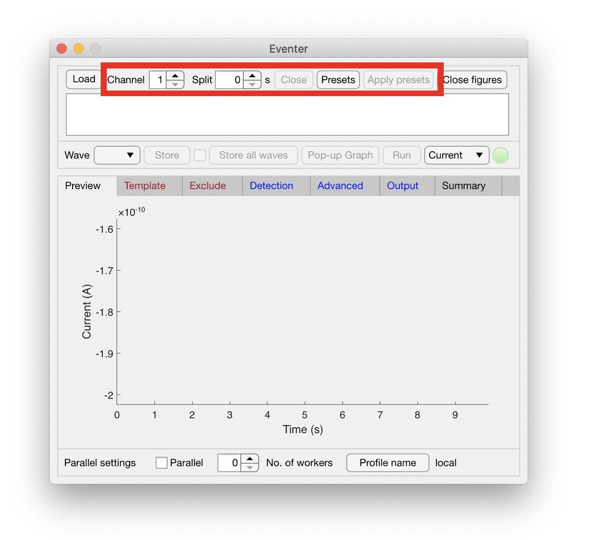
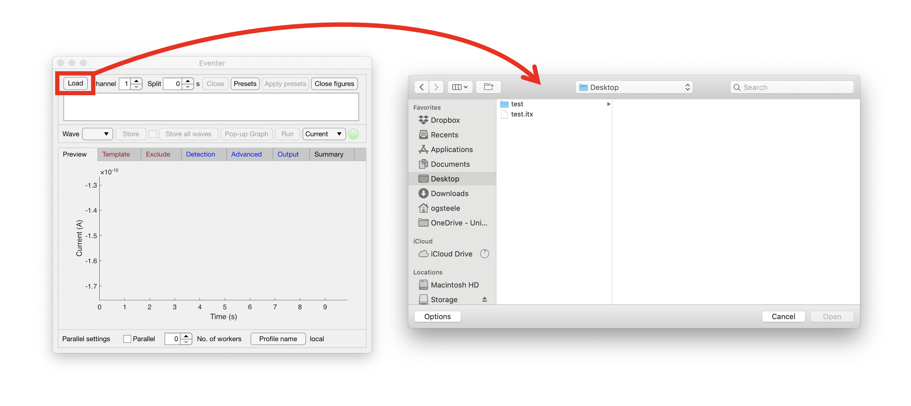
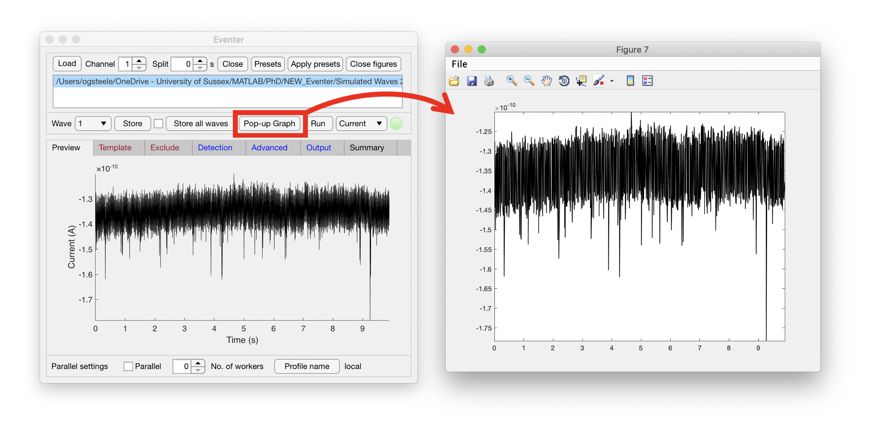
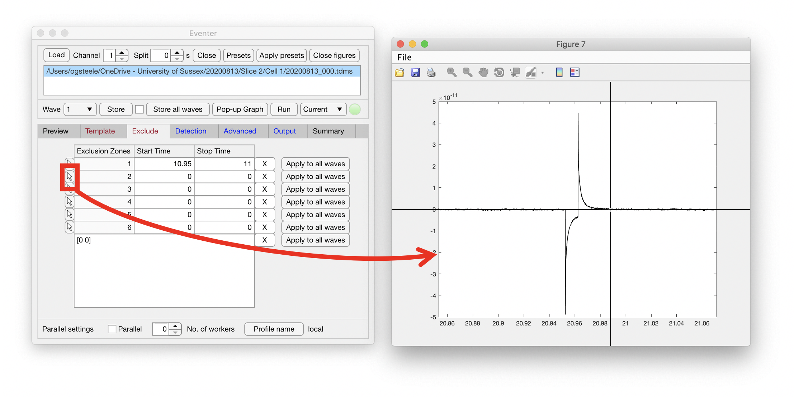
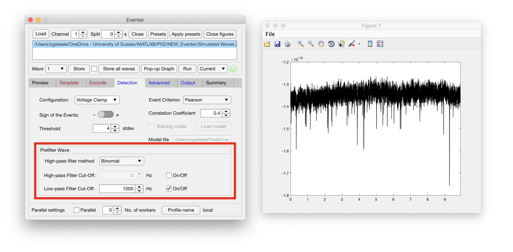
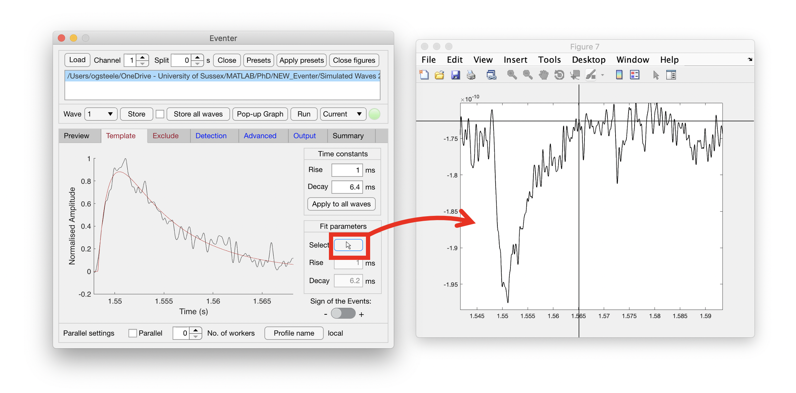
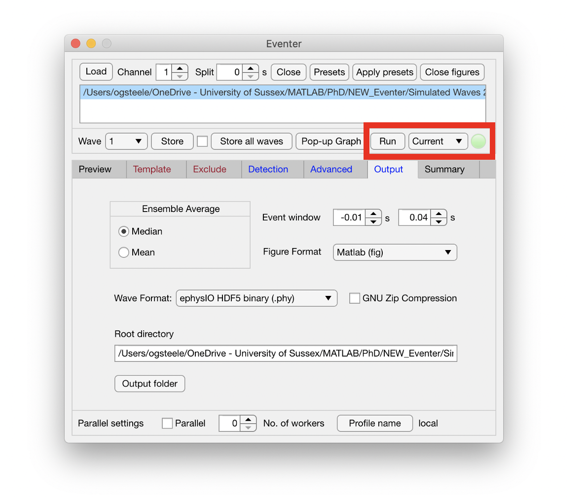
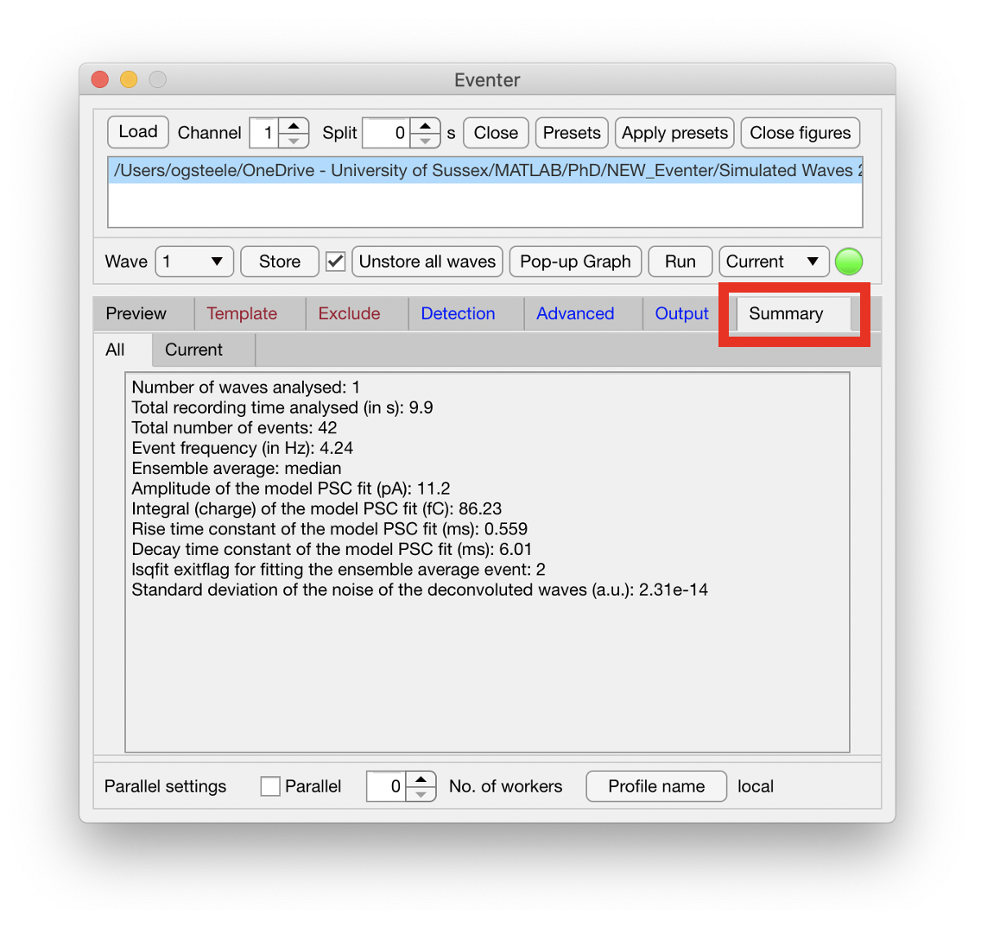
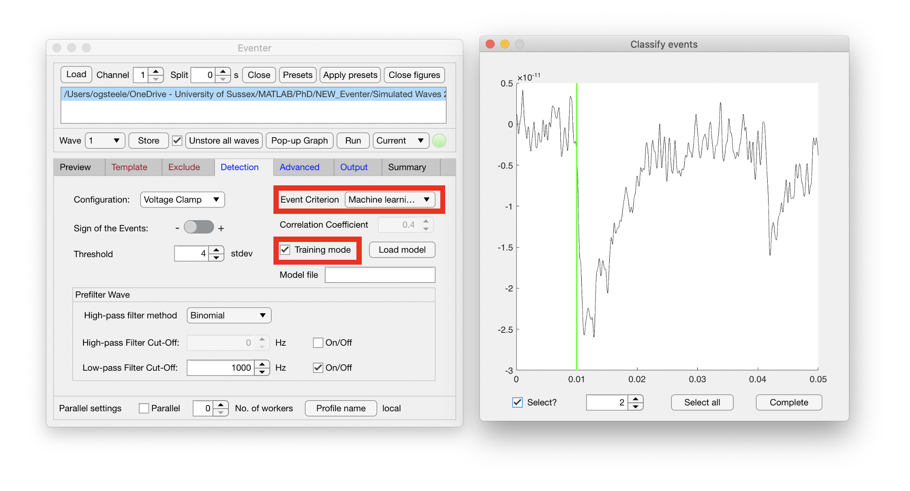
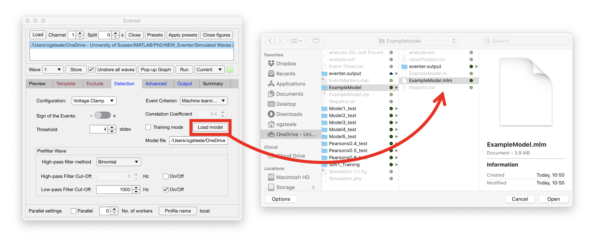

```{r setup, include=FALSE}
# install devtools to install emoji package and learnr
if (!base::require(package="devtools")) utils::install.packages("devtools")
if (!base::require(package="emo")) devtools::install_github("hadley/emo")
# attach libraries
library(learnr)
library(emo)
knitr::opts_chunk$set(echo = FALSE)
```


## Important notice
| <font size="7">  `r emo::ji("exclamation")` REQUEST FOR CONSENT `r emo::ji("exclamation")` </font> |
|:---------------------------|

In part of this workshop we will ask you to classify what you think is, or is not, a 'real' synaptic current. This is a common step in the analysis of spontaneous mESPCs using manual classification. By continuing with this workshop you are providing your consent that your mEPSC classification can be used in a data set, which may be used for publication. **This does not require you to provide or share any personal data.** 

If you do not wish to provide consent, please contact a tutor or the the staff member organising the workshop.

## Learning outcomes

By the end of this workshop a successful student should be able to:

* Gain a comprehensive understanding of the methods used in preparing for and conducting patch clamp recordings in brain slices

* Interpret and scrutinize data or output from software used to detect mEPSCs and measure mEPSC properties

* Critically evaluate the application of the methods and their significance

## Prelude  

<font size = "3">  

Welcome to the slice physiology workshop! In this workshop you will have virtual lab demonstrations of acute and organotypic brain slice preparation and whole-cell patch-clamp electrophysiology in brain slices. This will be followed by hands-on analysis of example data of miniature excitatoy synaptic currents using open source softwar packages, Eventer and Stimfit. Work through the below tabs in order and don't hesitate to ask questions with a tutor at any point! 

You can ask us in the class or using the padlet below. Note that your posts are anonymous and your tutors receive alerts when you post questions.

https://uofsussex.padlet.org/acpenn/cuv8zste0em2xyur

Throughout this worksheet you'll notice several symbols, make sure to pay attention to these as these will help guide you through the session. The below table should hopefully explain what these mean.

| Symbol | Meaning | What should i do when seeing this? |  
|:-----------------|:--------------------|:--------------------|  
| <font size="7">  `r emo::ji("open_book")` </font> | Reading | Information for you to read
| <font size="7">  `r emo::ji("clapper")` </font> | Video | A video for you to watch
| <font size="7">  `r emo::ji("thinking")` </font> | Question |  Please answer and be prepared to feed back to the tutors through the session |  
| <font size="7">  `r emo::ji("exclamation")` </font> | Task | Best to follow these instructions ... |  
| <font size="7">  `r emo::ji("angel")` </font>` | Tip | These little people are just here to help, they may make your life a bit easier! |  

Please enjoy the session, and make the most of it by asking any questions you have - we're happy to help.  

## Background  

<font size = "3">  

| <font size="7">  `r emo::ji("open_book")` </font> WHY HAVE A WORKSHOP ON PATCH CLAMP IN BRAIN SLICES? |
|:---------------------------|


**Why study excitatory synaptic transmission?**
The synapse is a site of contact between two neurons. Excitatory chemical synapses are essential for information flow through neuronal circuits and a major site for the processing and storage of memories in the brain. Therefore, it is not surprising that synapses serve as the site of action for many prescribed medications and their disruption contributes to many neurological and psychiatric disorders. These include epilepsy, stroke, schizophrenia, autism, depression, addiction, Parkinson's disease, Alzheimer's disease, and traumatic brain injury. Hence, a fundamental understanding of the function, and plasticity of synapses is essential to advancing our knowledge about brain function in health and disease.

**Why brain slices?**
In our experiments, we record from brain tissue *ex vivo* brain tissue, meaning outside of the living body. This is achieved by cutting slices of the brain and either recording from them the same day (acute slices) or placing them in an incubator to culture over a couple of weeks before recording (organotypic slices). Brain slices maintain many aspects of *in vivo* biology, including functional local synaptic circuitry with preserved architecture. However, brain slices enable good experimental access compared to *in vivo* as well as precise control of the extracellular environment, for example using drugs, to help identify or isolate the molecular components underling measurements. In addition, voltage clamp recordings are more feasible in brain slices since it is easier to obtain good quality patch clamp recordings when patching under visual guidance (using a microscope). With organotypic slices, transfection or viral transduction can be accomplished relatively easily *in vitro* to study the function of novel genes or genetic manipulations. They are also amenable to longitudinal studies (i.e. repeated measurements of the same variable over time) without ethical concerns.
 
**Why patch clamp technique?**
Currents elicited by unitary synaptic connections at CNS synapses are typically very small, so for precise and controlled detection of synaptic events one is best employing intracellular recording techniques. Application of patch-clamp techniques to brain slices has significantly advanced research on endogenous ion channels and the properties of synaptic transmission in central neurons. This recording technique has allowed direct observation of spontaneous and evoked synaptic currents as well as the gating of endogenous ion channels at single-channel resolution. It can also be used to dialyze neurons with compounds that can highlight the morphology of cells, thus extending the capabilities of patch clamp to assisting in anatomical studies. Together, these advances have contributed to our understanding of passive and active biophysical properties of excitable cells. A major advantage of this technique is that it provides information in real-time on how specific manipulations (e.g., pharmacological, experimenter-induced plasticity) may alter specific changes in neuronal or ion channel function.

| <font size="7">  `r emo::ji("thinking")` </font> TOPICAL QUESTIONS |
|:---------------------------|

```{r background_questions}
# Include correct and incorrect statements to aid students understanding as necessary. 
quiz(
  question("Which of the following are advantages of recording from brain slices over recording *in vivo*? (multiple answers)",
    answer("They are more amenable to controlled pharmacological intervention",correct = TRUE),
    answer("They don't involve the use of animals for experiments"),
    answer("Whole-cell voltage-clamp experiments are more feasible",correct = TRUE),
    answer("The measurements more accurately resemble activity of neurons in a living animal"),
    correct = "Correct. Experiments on brain slices require the use of animals and removing brain tissue from the animal typically disturbs the on-going the activity of neuronal circuits.",
    try_again = "Not quite, try again.",
    try_again_button = "Try again",
    allow_retry = TRUE
  ),
  question("Which of the following would be good situations to use patch clamp recordings in brain slices? (multiple answers)",
    answer("To characterize conductances underlying neuronal signalling using voltage-clamp and pharmacological tools",correct = TRUE),
    answer("To map out functional connectivity in local circuits",correct = TRUE),
    answer("To characterize microscopic currents from single channels, which contribute to membrane conductances",correct = TRUE),
    answer("To perform functional and anatomical characterization of neurones in a brain region.",correct = TRUE),
    answer("To examine how membrane conductances respond to specific concentrations of agents delivered inside the cell.",correct = TRUE),
    correct = "That's right! All of these are good examples of applications for patch clamp in brain slices",
    try_again = "Not quite, try again.",
    try_again_button = "Try again",
    allow_retry = TRUE
  )
)
```

## 1. Brain Slices

We can either record from freshly cut brain slices (called acute slices) or we can place slices of brain tissue in an incubator and culture them for up to a few weeks before recording - we call these organotypic or cultured slices. Please find in each of the following subtopics a video demonstration and a set of questions for you to answer (these are not assessed).

## 1a. Acute slices

| <font size="7">  `r emo::ji("clapper")` </font> Virtual lab demo: Preparing acute hippocampal slices (16 mins) |
|:---------------------------|

This video was in the pre-lab handout. If you already watched it you may wish to skip straight to the questions below. If you do watch the video, please mute your microphone on zoom (unless you are using earphones).


https://youtu.be/EPYVjMOPcTE

| <font size="7">  `r emo::ji("thinking")` </font> QUESTIONS ABOUT ACUTE SLICES |
|:---------------------------|

```{r acute_slice_questions}
# Include correct and incorrect statements to aid students understanding as necessary. 
quiz(
  question("Which of the following represent benefits of the cutting solution being ice-cold? (multiple answers)",
    answer("It increases oxygen solubility in the solution", correct = TRUE),
    answer("It stops the brain overheating"),
    answer("It slows the activity of enzymes acting to damage the slice", correct = TRUE),
    answer("It reduces the metabolism of the tissue and lowers the risk of hypoxia.", correct = TRUE),
    answer("It reduces the metabolism of the tissue and lowers the risk of acidosis.", correct = TRUE),
    correct = "That's correct!",
    try_again = "Not quite, try again.",
    try_again_button = "Try again",
    allow_retry = TRUE
  ),
  question("Which ONE of the following is the ideal mix of Mg^2+^, Ca^2+^ and NaCl in the sucrose-based cutting solution?",
    answer("High Mg^2+^ High Ca^2+^ High NaCl"),
    answer("Low Mg^2+^ Low Ca^2+^ Low NaCl"),
    answer("High Mg^2+^ High Ca^2+^ Low NaCl", correct = TRUE),
    answer("Low Mg^2+^ Low Ca^2+^ High NaCl"),
    correct = "That's correct! Elevated Mg^2+^ (e.g. 7 mM) helps block NMDA receptors to reduce excitotoxicity and the high concentration of divalent cations is thought to result in screening membrane charges thereby raising the threshold of activation of voltage-gated ion channels. The higher Mg^2+^ also helps to antagonise the binding of Ca^2+^ to the putative Ca^2+^ sensor. Together with the lower Ca^2+^ (e.g. 0.5 mM), this helps to suppress seizure activity by reducing synaptic transmission thereby lowering the metabolic demands of the tissue. The low NaCl concentration (with osmolarity corrected with sucrose) helps to prevent cells from swelling by osmosis during the slicing procedure.",
    try_again = "Not quite, try again.",
    try_again_button = "Try again",
    allow_retry = TRUE
  )
)
```

## 1b. Organotypic slices  

| <font size="7">  `r emo::ji("clapper")` </font> Virtual lab demo: Preparing organotypic hippocampal slices (27 mins) |
|:---------------------------|

This video was in the pre-lab handout. If you already watched it you may wish to skip straight to the questions below. If you do watch the video, please mute your microphone on zoom (unless you are using earphones).


https://youtu.be/GvUg0wiu_p8

| <font size="7">  `r emo::ji("thinking")` </font> QUESTIONS ABOUT ORGANOTYPIC SLICE CULTURE |
|:---------------------------|

```{r organotypic_slice_questions}
# Include correct and incorrect statements to aid students understanding as necessary. 
quiz(
  question("Which ONE of the following is the pH buffering system most often used in cell culture?",
    answer("10 mM HEPES"),
    answer("10 mM Tris-Cl"),
    answer("25 mM Na-HCO<sub>3</sub>"),
    answer("25 mM Na-HCO<sub>3</sub> + 5% CO<sub>2</sub>", correct = TRUE),
    correct = "That's correct! Cell culture often uses the same buffering system used in the blood and CSF, which is a balanced combination of Na-HCO<sub>3</sub> and 5% CO<sub>2</sub>",
    try_again = "Not quite, try again.",
    try_again_button = "Try again",
    allow_retry = TRUE
  ),
  question("Which ONE of the following is the age of rodents typically used to prepare organotypic hippocampal slices?",
    answer("P0"),
    answer("P5-7", correct = TRUE),
    answer("P21"),
    answer("P40 or older"),
    correct = "That's correct! The success rate for culturing slices from rodents older than about P10 tends to drop and hippocampal slices cultured from younger animals (P0) do not maintain well the defined organisation and structure of the hippocampus",
    try_again = "Not quite, try again.",
    try_again_button = "Try again",
    allow_retry = TRUE
  )
)
```

## 2. Patch clamp recording

Now we have prepared our slices it's time to actually record from them!


| <font size="7">  `r emo::ji("clapper")` </font> Virtual lab demo: Patch clamp in brain slices (37 mins) |
|:---------------------------|

This video was in the pre-lab handout. If you already watched it you may wish to skip straight to the questions below. If you do watch the video, please mute your microphone on zoom (unless you are using earphones).


https://youtu.be/jETRgJp7DZY

| <font size="7">  `r emo::ji("thinking")` </font> QUESTIONS ABOUT PATCH CLAMP AND mEPSC RECORDING |
|:---------------------------|

```{r patchclamp_questions}
# Include correct and incorrect statements to aid students understanding as necessary. 
quiz(
  question("What is the coating on the wires used for recording and ground electrodes?",
    answer("Silver"),
    answer("Tungsten"),
    answer("Platinum"),
    answer("Silver chloride", correct = TRUE),
    correct = "That's correct! A silver chloride electrode helps to reduce the junction potential at the liquid-metal interface.",
    try_again = "Not quite, try again.",
    try_again_button = "Try again",
    allow_retry = TRUE
  ),
  question("How will the current change when applying test voltage pulses for a the patch pipette in the bath -> cell-attached -> whole-cell configuration?",
    answer("large, slow transient -> very small square pulse -> large square pulse"),
    answer("large square pulse -> very small square pulse -> large, slow transient", correct = TRUE),
    answer("very small square pulse -> large square pulse -> large, slow transient"),
    answer("very small square pulse -> large, slow transient -> large square pulse"),
    correct = "That's correct!",
    try_again = "Not quite, try again.",
    try_again_button = "Try again",
    allow_retry = TRUE
  ),
  question("Which drug would one add to the aCSF to ensure that spontaneous synaptic currents reflected miniature synaptic transmission (i.e. quantal transmission: the release of a single vesicle of neurotransmitter)?",
    answer("Botulinum toxin"),
    answer("Tetanus toxin"),
    answer("Tetradotoxin", correct = TRUE),
    answer("Picrotoxin"),
    correct = "That's correct! Tetradotoxin blocks voltage-dependent sodium channels thereby preventing action potential-evoked, and potentially multivesicular, neurotransmitter release. This just leaves the stochastic release of neurotransmitter vesicles. It is typically used at a concentration of about 1 microM.",
    try_again = "Nope, try again. Try looking up these toxins with google or wikipedia to find out what they do.",
    try_again_button = "Try again",
    allow_retry = TRUE
  ),
  question("Which drug would one add to the aCSF to ensure that spontaneous synaptic currents reflected excitatory rather than inhibitory synaptic currents?",
    answer("APV"),
    answer("CNQX"),
    answer("Tetradotoxin"),
    answer("Picrotoxin", correct = TRUE),
    correct = "That's correct! Picrotoxin blocks GABA<sub>A</sub> receptors that mediate inhibitory postsynaptic currents. It is typically used at a concentration of about 50 microM.",
    try_again = "Nope, try again. Try looking up these drugs/toxins with google or wikipedia to find out what they do.",
    try_again_button = "Try again",
    allow_retry = TRUE
  )
)
``` 


## 3. Detecting mEPSCs

In the section we will be analysing some of the data like the ones we generated during the experiment seen in the previous topic. Synaptic events are particularly small, and some of them can be hard to distinguish from background noise. There is lots of software available to detect spontaneous synaptic currents. We use an open-source software designed to use time course information about the events of interest to help identify events occur, extract those parts of the recording and align the putative events. This software, developed by our lab at Sussex, is called [Eventer](https://eventerneuro.netlify.app/) (https://eventerneuro.netlify.app/) and it facilitates speedy and reproducible analysis of spontaneous synaptic currents. 

| <font size="7">  `r emo::ji("clapper")` </font> Virtual lab training: Learning how to use Eventer (20 min)|
|:---------------------------|

When you watch the video, please mute your microphone on zoom (unless you are using earphones).


https://www.youtube.com/watch?v=gaRo8SijUtg&t=34s


| <font size="7">  `r emo::ji("exclamation")` </font> ANALYSIS OF mEPSCs USING EVENTER |
|:---------------------------|


### Start the software

If the Eventer software is not already loaded, double click on the Eventer icon visible on the desktop. It looks like this:

<left>
{width=10%}  
</left>

### Settings we need to check before loading the data

Before selecting the data file we want to load, we need to set: 

* which recording channel we want to load, and 
* whether we want to split the recordings into smaller waves settings. 

Only some data formats allow for multiple recording channels; the recordings you will analyse only have 1 channel so the `Channel` setting can be left at the default value of 1. Split can be used if you want to split a continuous recording wave into smaller waves for parallel processing or to synchronous artifacts (e.g. current transients resulting from test pulses). The recording you will analyse is 1.5 minutes long with test pulses delivered every 30 seconds. Therefore, the first thing to do is set the `Split` value to 10 seconds. This will separate the 1.5 minute recording into 3 waves that are 10 seconds long each.


<center>
{width=100%}  
  <br>
**Figure 1** *Pre-load settings in Eventer*
</center>


### Loading your data  

Click the `Load` button and locate the data file you have been allocated to analyse in the file dialog. The file will be located in the following directory: `S:\ATiN\Tutorial\Eventer\Group [Room Number]`  
Ask a tutor if you do not know which file to load.

<center>
{width=100%}    
  <br>
**Figure 2** *Loading your data in Eventer*
</center>


### Visualising your data

Eventer includes a preview tab for immediate visualisation of your data upon loading. To preview each of the waves, click on the `Wave` dropdown menu and select a wave number. To inspect the data in more detail, the ‘Pop-up Graph’ should be used as shown here. This graph can then be zoomed and dragged to located individual events using the tools located in the toolbar.

<center>
{width=100%}  
  <br>
**Figure 3** *Visualizing your data in Eventer*
</center>

<font size="4">  

| <font size="7"> `r emo::ji("angel")` </font> TIP |
|:---------------------------|
| *Hover the mouse over features on the Eventer interface to get a short description or tooltip.* |  
| |  


</font>

### Excluding regions from your analysis

It is possible that there are regions of your data that you want to be excluded from the analysis. For example, this could be a particularly noisy section of recording or the inclusion of a test pulse as shown here. The synaptic events we recorded are all excitatory, so by convention downwards at this holding potential, however the current transients resulting from the test pulse are still visible and very large. These should be apparent near the start of the wave - we will exclude these artifacts from the analysis. To exclude these regions, open the `Exclude` tab and either:  

* manually type in the start and end time of the exclusion zone around the test pulse, or  
* click the button decorated with a cursor pointer and click twice on the pop-up graph (Figure 4), before and after the artifact

Since the artifact occurs at the same time in all waves, click the button `Apply to all waves`.

Look through the four waves again - are there any any periods of the recording where the baseline is unstable or the recording noise transiently becomes larger, which you might want to exclude. (Note that you probably won't want to apply those additional exclusion zones at the same time in all the waves!)

<center>
{width=100%}  
**Figure 4** *Excluding regions from your analysis in Eventer*
</center>  


### Filtering your data

It is possible that excess high frequency noise is still present in your data that may not have been isolated during data acquisition. Eventer enables the user to filter their data through high- and low-pass filter cut offs. In the figure below, a 1 kHz **low-pass** filter has been set. To apply a 1 kHz low pass filter to your data, click the `Detection` tab, tick the appropriate `On/Off` checkbox and type 1000 Hz into the field labeled `Low-pass Filter Cut-Off`.

<center>
{width=100%}  
**Figure 5** *Filtering your data in Eventer*
</center>


### Defining your event template

We now must define a model template EPSC waveform that Eventer will use to detect the spontaneous mEPSCs by deconvolution. The deconvolutioon method used is based on [Pernía-Andrade et al., 2012] (https://www.ncbi.nlm.nih.gov/pmc/articles/PMC3471482/). The model event is defined by the sum of two exponentials using the following equation:

$$f(t) = exp \left (\frac{-t}{\tau_{decay}} \right ) - exp\left (\frac{-t}{\tau_{rise}} \right )$$ 
<font size="2">$$\textrm{Where}\ t \ \textrm{is time},\ \tau_{decay}\ \textrm{is the decay time constant and}\ \tau_{rise}\ \textrm{is the rise time constant.}$$</font>

Select the `Template` tab next to load the interface for this task. Click on the `Pop-up Graph` button and zoom in on an exemplary mEPSC. Next, click the button decorated with the cursor pointer (highlighted in the figure below) and click on the pop-up graph at two positions; one just before the mEPSC and the other after the mEPSC has decayed. Eventer will try to fit a model mEPSC waveform to the selected data. The time constants will then be in the boxes below the highlighted button and should then be copied into boxes above before selecting the button `Apply to all waves`. Ensure the sign of your events is correctly assigned as `-`.

<center>
{width=100%}  
**Figure 6** *Defining your event template in Eventer*
</center>

### Running your analysis

We now need to ensure the that output of the analysis will be what and where we want it to be. Click the `Output` tab to show the range of options available then click the `Output folder` button **and name it with your surname**.  

Next, click the `Wave Format` drop-down menu and select `HDF5 (Stimfit) binary (.h5)` - this is because we will analyse further the detected and aligned mEPSCs using another software  (Stimfit) in the next topic.   

Next, click the `Store all waves` button to ensure that the analysis is applied to all 4 waves. 

Next, click the drop-down menu (highlighted in the figure below) and change it from `Current` to `Batch` - this will tell Eventer to analyse all stored waves.  

Having confirmed all these settings the user can hit ‘Run’ and the light will turn green indicating analysis is in progress.

<center>
{width=100%}  
**Figure 7** *Running your analysis in Eventer*
</center>

### Accessing your results

After running the analysis, Eventer will open multiple figures. A quick summary of results is also available in the summary tab as shown here. Your results will be saved in the output folder that you specified with your surname.

`S:\ATiN\Tutorial\Eventer\<your_surname>` 

<center>
{width=100%}  
**Figure 8** *Summary of your results from Eventer*
</center>


| <font size="7">  `r emo::ji("angel")` </font> Iterate your analysis to improve your fit|
|:---------------------------|


It is worth checking initially the bottom left hand image (Figure 4 on the eventer output) to see how well your template fits the actual events being detected. If the template doesn't match perfectly the ensemble average mEPSC, the time constants may need a little adjusting. Similar to when you defined your event template the first time, the event time constants obtained from that analysis will be shown in the 'Summary' tab and then also on the 'Template' tab. The time constants will be in the boxes below the highlighted button (on the Template tab) and should then be copied into the boxes above before selecting the button `Apply to all waves`. Re run your analysis here and see if the event template fits better. 

### Training a machine learning model

Eventer also includes an option to enable users train a machine learning model against an exemplary set of data. To do this, click the `Detection` tab, then set the `Event Criterion` drop-down menu to `Machine Learning` before ticking the `Training Mode` tick box. Running the analysis now will open up a window that will ask users to classify event detection as true or false. A pop-up window will appear asking for you to name your model - leave this as your surname. Click the `Store` button again, followed by the `Run` button. 

After the analysis has completed, a pop-up window titled 'Classify events' will appear. In this window, click the `Start` button and then the `Select all` button. To scroll up or down through the detected events, press the `K` or `M` keys respectively on your keyboard. 

Use you judgment to make a call on whether you think the mEPSC (starting at the time of the vertical <font color="green">green</font> line) should be considered a real event. If you think Eventer falsely detected an event, press the `R` key to deselect it. When you have visually inspected and classified all of the candidate mEPSCs, click the `Complete` button to close the `Classify events` window and train a machine learning model using the Random Forests algorithm. This algorithm builds decision trees using various predefined features of the data to best satisfy your classification. Upon completing the classification and starting the training, you will be presented with a plot showing the out-of-bag classification error which can briefly be described as a measure of the prediction error using bootstrap aggregating (bagging) to subsample data samples used for training. The prediction error should then stabilize well before reaching 128 trees (which is the default number of trees used by the implementation of Random Forests in Eventer).

<center>
{width=100%}   
**Figure 9** *Training a machine learning model in Eventer*
</center>


### Using a machine learning model
The real beauty of machine learning is that trained models can be used to apply your criteria of selection or classification to a set of new data. Lets give this a go using a model prepared in our lab using a different (but comparable) recording. 

Click on the `Detection` tab - you will notice that the `Training mode` checkbox is already unchecked and the machine learning model (.mlm) file listed is the one you just created. that will  and select load model in the detection tab. The trained model will be stored in the eventer output folder as a .mlm file as shown here. This model is now available for use on a new dataset, distinct from the set it was trained on. 

Click the `Load model` button, navigate to `S:\ATiN\Tutorial\Eventer\model` in the file dialog and load the file named `model.mlm`.

To ensure we save the output of this analysis to a different place, click the `Output` tab to show the range of options available then click the `Output folder` button **and name it with your surname followed by \_mlm **. 

Finally, click the `Store` button followed by the `Run` button.

<center>
{width=100%}   
**Figure 10** *Using a machine learning model in Eventer*
</center>

<br>

## 4. Measuring EPSC properties

We have detected mEPSCs and we have some basic summary data about them from Eventer. Lets now get some detailed data about the amplitude and kinetics of individual events. We will achieve this using the open source python-based software package called [Stimfit] (https://github.com/neurodroid/stimfit) (https://github.com/neurodroid/stimfit).

### Start the software

If the Stimfit software is not already loaded, double click on the Stimfit 0.13 icon visible on the desktop. It looks like this:

<left>
{width=10%}  
</left>

### Become familiar with the Stimfit user interface

Visit the following webpage to familiarise yourself with the Stimfit interface:
https://neurodroid.github.io/stimfit/manual/getting_started.html

### Load the a file of the aligned and exported mEPSCs detected by Eventer

Click on the `File` menu and click `Open...`

<center>
{width=100%}  
<br>
**Figure 11** *Open the Stimfit file open dialog*
</center>
<br>
Then navigate to `S:\ATiN\Tutorial\Eventer\<your_surname>_mlm\eventer.output\All_events` and open the file called `event_data.h5` 

<br>

<center>
{width=100%}  
<br>
**Figure 12** *Select the data file for analysis*
</center>
<br>

When the file has loaded, you will see the first detected mEPSC and you can scroll through the mEPSCs (1 mEPSC per wave, or trace as Stimfit refers to them) by pressing the `right` and `left` cursor keys on your keyboard.

<center>
{width=100%}  
<br>
**Figure 13** *Stimfit with the data loaded*
</center>

### Configure cursor settings

The mEPSCs are downward deflections of the current, so before we ask Stimfit to make measurements on the mEPSCs, we need to tell Stimfit that we expect peaks to be negative.   

First, go to the `Edit` menu and click `Cursor settings...`.

<center>
{width=100%}  
<br>
**Figure 14** *Loading the cursor settings window*
</center>
<br>
The cursor settings window will then load. Under the `Peak` tab and `Peak direction` section, click the `Down` radio button.  

<center>
{width=50%}  
<br>
**Figure 15** *Set the direction of mEPSC peak measurements*
</center>
<br>

<font size="4">  

| <font size="7"> `r emo::ji("angel")` </font> TIP |
|:---------------------------|
| *You can reduce the influence of noise on your peak measurements by asking Stimfit to measure an average of a user-defined number of points centered around the peak. To do this, under the `Peak` tab of the `Cursor settings` window, enter an number (e.g. 25) in the `User-defined` text entry box just below where it says `Number of points for peak`, followed by `Apply`, then `Close`. N.B.: If you change tabs, make sure you press `Apply` first otherwise recent changes will be lost.* |  
| |  


</font>

### Calculate ensemble mean mEPSC

Lets now calculate an ensemble mean mEPSC to help us decide on where to position the cursors used for making measurements. Press `Ctrl + A` key combination to select all of the mEPSCs and then the highlighted button to average the selected traces. This will pop up a new window which you should close by clicking `Close` in the `File` menu. You will then see the ensemble mean mEPSC in <font color="blue">blue</font> overlaid onto one of the currently selected mEPSC.  

<center>
{width=100%}  
<br>
**Figure 16** *Calculating the ensemble mean mEPSC*
</center>


### Set peak cursors

The mEPSCs are downward deflections of the current, so before we ask Stimfit to make measurements on the mEPSCs, we need to tell Stimfit that we expect peaks to be negative. Press the `P` key, then click the left mouse button where you want the peak calculation to start and click the right mouse button where you want the peak calculation to end. The start and end of the peak search region is illustrated by <font color="red">red</font> vertical dashed lines. Use the ensemble mean mEPSC as a guide for where you position these cursors.  

<center>
{width=100%}  
<br>
**Figure 17** *Set the <font color="red">red</font> peak cursors*
</center>
<br>

### Set the baseline cursors

The holding current is seldom exactly zero so we need to subtract the constant offset represented by the baseline preceding the mEPSC. Press the `B` key, then click the left mouse button where you want the baseline calculation to start and click the right mouse button where you want the baseline calculation to end. The start and end of the baseline region is illustrated by <font color="green">green</font> vertical dashed lines. for each mEPSC, the offset will be calculated as the mean of the sample points between these two time points. Use the ensemble mean mEPSC as a guide for where you position these cursors.  

<center>
{width=100%}  
<br>
**Figure 18** *Set the <font color="green">green</font> baseline cursors*
</center>
<br>

### Visualising measurements

If you now scroll through the mEPSCs using your `left` and `right` cursor keys, you will notice that there are additional annotations, like in the figure below. See figures 10-13 and the associated text on the following web page to understand what these represent: https://neurodroid.github.io/stimfit/manual/getting_started.html

<center>
{width=50%}  
<br>
**Figure 19** *Measurement annotations*
</center>
<br>
Do the annotations make sense? If not, consider going back and resetting your peak and baseline cursors.

### Batch analysis of mEPSC propeties

Now click on `Batch analysis...` under the `Analysis` menu to load a pop-up with a list of options.

<center>
{width=100%}  
<br>
**Figure 20** *Loading the batch analysis options*
</center>
<br>

Check the boxes only for `Peak (from base)`, `Lo-Hi% risetime` and `Half amplitude duration` then press `OK`.

<center>
{width=50%}  
<br>
**Figure 21** *Selecting batch analysis options*
</center>
<br>


A table of results will appear on the left hand side listing the amplitude, 20-80% rise time and full-width half-maximum for each event. Copy and past this data into a spreadsheet and save it in a file named with your surname in the following location:
`S:\ATiN\Tutorial\Eventer\student_mEPSCs\`
The staff member running your workshop will post your data on Canvas for you to download.

<center>
{width=50%}  
<br>
**Figure 22** *Table of results*
</center>
<br>

## Report

As part of your assessment you may choose to write a lab report based on this workshop. The report should be no longer than 3000 words. If you write a report for this workshop, I suggest the following structure.   

* Title
* Abstract
* Introduction
* Methods
* Results
* Discussion
* References

Introduce the methods used to making patch clamp recordings in brain slices and briefly describe their impact on neuroscience research, particularly in the field of synaptic physiology. Describe the quantal nature of synaptic transmission, briefly including historical aspects of its discovery. Introduce how researchers isolate miniature synaptic currents and the difficulties in detecting/identifying them in neurons, especially miniature excitatory postsynaptic currents (mEPSCs). Finish the introduction by telling the reader about the aim of the practical and very briefly what you found.

Choose to describe the methods for preparing, and recording from, either acute **OR** organotypic hippocampal slices. Summarise the approach used to record, detect and analyse mEPSCs. Be clear about the conditions under which mEPSC recordings are made to ensure that they are 'excitatory' and 'miniature' and be specific about what exactly you are measuring (e.g. 20-80% rise time? 10-90% rise time? If applicable, how many points are you averaging around the peak?). What software did you use to make the recordings.
 
In your software of choice (e.g. Excel, R/RStudio, SPSS) and outside the class you will be expected to analyse the data. Calculate and tabulate and/or graph descriptive statistics for the three mEPSC properties (peak, rise time and full-width half-maximum). Examine the distributions of each of the three mEPSC properties using histograms and/or kernel density estimates. Describe what they look like... is it what you expected? Would it make more sense to create histograms (or kernel density estimates) from the log-transformed data? Analyse the relationship of the mEPSC properties with one another...are they correlated?

Critically discuss your results and the application of the various techniques. Possible areas of discussion of your results and your reading on the subject could include:  

* Your recordings represent mEPSCs recorded from one hippocampal pyramidal neuron. What could be the sources of variability underlying the various mEPSC properties you measured?
* Compare your results with what is observed in the literature. Do you think you see the same thing? What factors may affect the relationship between mEPSC shape and size?
* Discuss alternative ways of triggering and measuring mEPSCs.
* Discuss alternative approaches/algorithms that can be used to detect spontaneous synaptic transmission.

If you finish early, you may wish to get started on analysing the data during the lab.

## Suggested reading

PATCH CLAMP IN SLICES

[Chapter 6: "Patch-clamp techniques applied to brain slices" in Walz et al. (2002) Patch-Clamp Analysis Advanced Techniques. (Humana Press) (preview-only)](https://canvas.sussex.ac.uk/courses/11965/pages/patch-clamp-in-slices)

[Segev et al. (2016) Whole-cell Patch-clamp Recordings in Brain Slices. J Vis Exp. (112): 54024. (Links to an external site.)](https://www.ncbi.nlm.nih.gov/pmc/articles/PMC4927800/)


DETECTING SPONTANEOUS SYNAPTIC CURRENTS

[Pernía-Andrade et al. (2012) A Deconvolution-Based Method with High Sensitivity and Temporal Resolution for Detection of Spontaneous Synaptic Currents In Vitro and In Vivo. Biophys J. 103(7): 1429–1439. (Links to an external site.)](https://www.ncbi.nlm.nih.gov/pmc/articles/PMC3471482/)


SYNAPTIC PHYSIOLOGY

[Section "Quantal analysis: Probing synaptic physiology" in Squire et al. (2008) Fundamental Neuroscience (3rd Edition) p173-176Preview the document (preview only)](https://canvas.sussex.ac.uk/courses/11965/pages/synaptic-physiology)

[Bekkers and Stevens (1996) Cable properties of cultured hippocampal neurons determined from sucrose-evoked miniature EPSCs. J Neurophysiol. 75(3):1250-5](https://pubmed.ncbi.nlm.nih.gov/8867133/)

N.B. If a link takes you to Canvas, after you enter your login details it will ask if you want to 'Stay signed in?', to which you should reply 'No', because you are currently on a shared profile.

## Acknowledgements

Oliver Steele, Ella Bates and Dr Elmasri for all of video material and photos from the lab used to make the videos!
